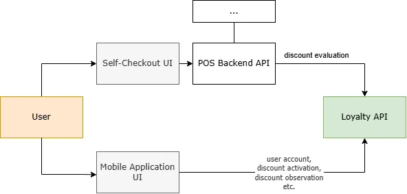

## About
It's an API that is used for customer loalty program.

## Features
- User account creation
- Coupon activation
- Observation of user's current (used or active) discounts
- Cart price calculation for individual user based on global discounts, specific discounts, coupons and vouchers
- Adding and managing global discounts, coupons, vouchers

## Installation
   `git clone github.com/turzhyk/loyaltysystem`
## Structure
This API uses Clean Architecture including layers:
- API (controllers, middleware)
- Application (services, calculators, exceptions, DTOs)
- Domain (domain models, enums)
- Infrastructure (database contexts, entities, seeders)

## Techonologies and Tools
- .NET 8
- Strategy & Factory Patterns (to divide and incapsulate calculators for different Discount Types)
- EF Core (for convinient interactions with DB)
- Docker with Postgres conatainer (database)
- Moq + xUnit (for unit tests)

